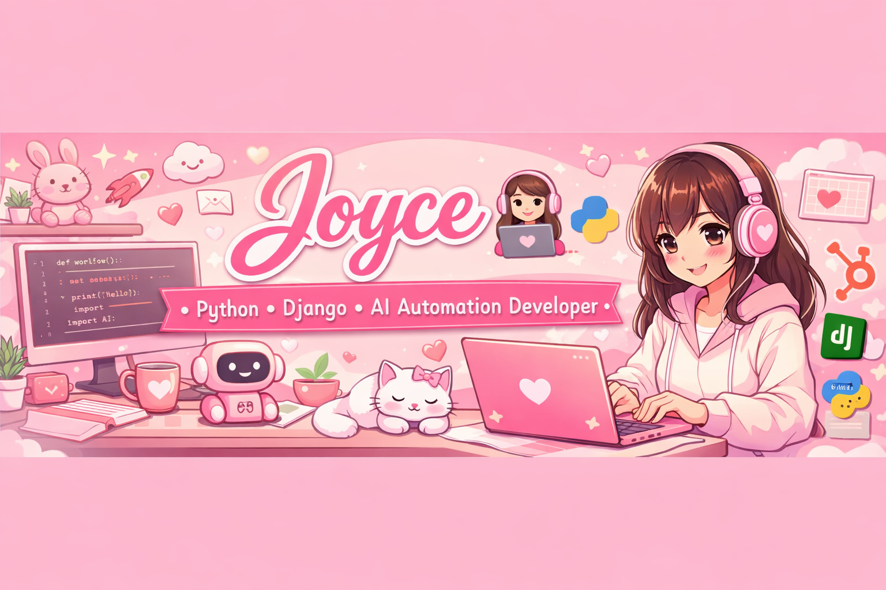

<!-- Banner -->

# 💖 Joyce Njathi | AI Automation & Backend Engineer 👩‍💻⚡

I build AI-powered automation systems that help businesses save time, manage data, and scale operations.

---

## 🚀 About Me

Hi, I’m Joyce 👋  
A developer focused on **AI automation, CRM systems, and backend workflows**.

I specialize in turning manual business processes into **fully automated systems using AI + APIs**.

🐱 Cat lover | ☕ Coffee enthusiast | ⚡ Automation builder

---

## 💼 What I Do

🤖 AI Workflow Automation (n8n, OpenAI, APIs)  
🔗 CRM Integrations (HubSpot, Apollo, custom systems)  
📧 Email Automation Systems  
📊 Lead Management Automation  
⚙️ Backend Development (Python, Django, APIs)

---

## ⚙️ Tech Stack

**Languages**
Python • Java • Kotlin • JavaScript

**Backend & Web**
Django • REST APIs • HTML • CSS • JSON

**Automation Tools**
n8n • Make (Integromat) • HubSpot API • OpenAI API • Apollo API

---

## 🚀 Featured Projects

### 🤖 AI HR Application Automation
Automates recruitment workflows using AI.

- Processes job applications automatically
- Uses AI to analyze candidates
- Sends automated responses
- Reduces HR workload significantly

---

### 📧 AI Email Automation System
Smart email processing and response system.

- AI email classification
- Automated replies
- Inbox organization system
- Workflow automation with n8n

---

### 🔗 Apollo → HubSpot CRM Automation
CRM synchronization system for clean sales data.

- Prevents duplicate contacts
- Syncs Apollo leads into HubSpot
- Auto-updates CRM records
- Real-time data management

---

## 💰 Freelance Services

I build automation systems for businesses that want to:

✔ Save time with AI automation  
✔ Automate CRM and lead management  
✔ Improve email workflows  
✔ Scale operations without extra staff  

📩 Email: **joycenjathiva@gmail.com**

---

## 🌱 Currently Learning

✨ Advanced AI agents  
✨ Scalable backend architecture  
✨ API integrations at enterprise level  
✨ Automation system design  

---

## 💡 Fun Fact

I turn boring manual business tasks into systems that run 24/7 automatically ⚡

Building automation systems for real-world business workflows using AI + APIs.
